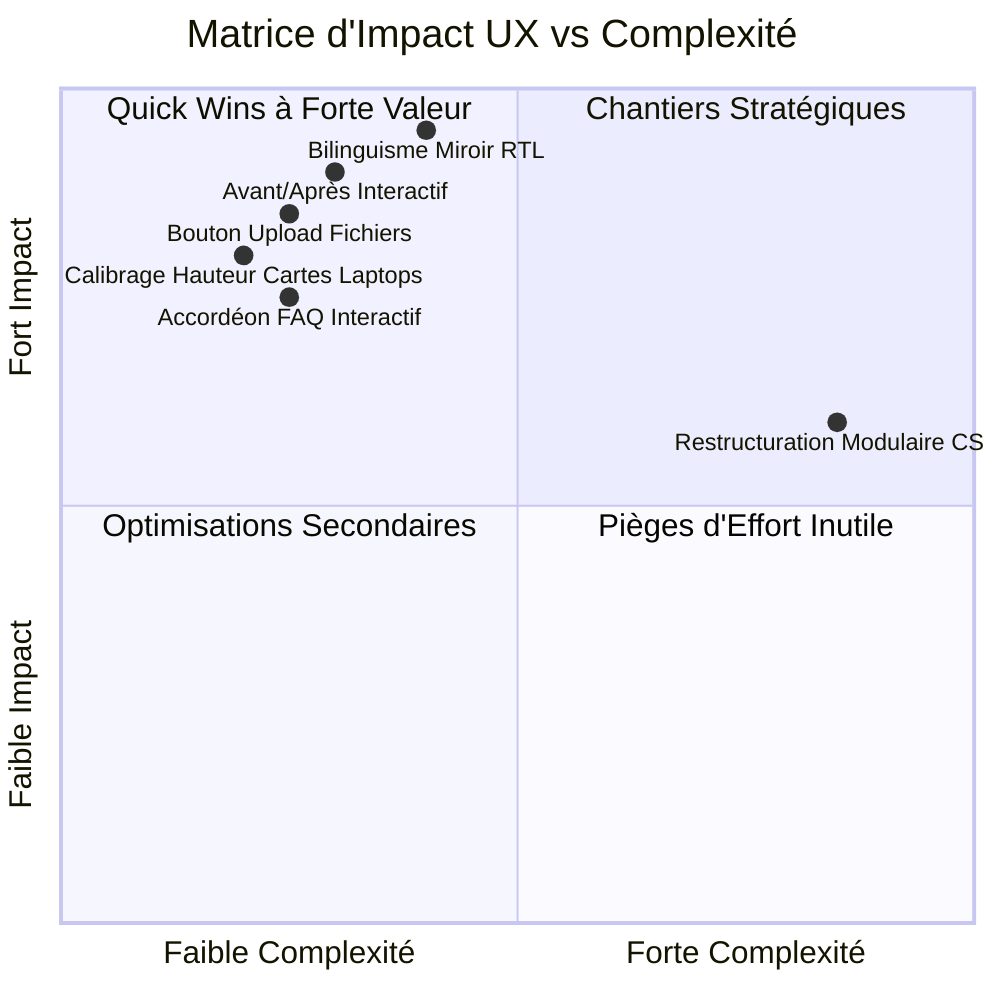

# AUDIT EXPERT UI / UX & DESIGN SYSTEM (REVUE 360° DE TOUTES LES PAGES)
**Rôle :** Principal UX/UI Product Designer & Design Systems Lead (Spécialiste Architecture, Luxe & Portails Bilingues)  
**Projet :** RSF Travaux (Plateforme Bilingue FR / AR — 52 Pages)  
**Date d'audit :** Septembre 2026  
**Référence méthodologique :** Nielsen Norman Group (NN/g) Heuristics & Google Material / Apple HIG Standards  

---

## 1. Synthèse Exécutive & Grille de Maturité UI/UX



### Scorecard Global du Portail

| Dimension Évaluée | Note / 10 | Statut | Synthèse de l'Expert UI/UX |
| :--- | :---: | :---: | :--- |
| **Identité Visuelle & Raffinement Luxe (UI)** | **9.2 / 10** | **Exceptionnel** | Palette chromatique noble (Bleu Nuit, Or Champagne, Ivoire minéral). Allure de catalogue d'architecture contemporaine. |
| **Architecture de l'Information & Navigation (IA)** | **9.0 / 10** | **Excellence** | Parcours fluide en 6 pages piliers + 18 services dédiés. En-tête fixe avec effet blur, tiroir mobile fluide. |
| **Ergonomie Mobile & Touch Targets (UX Mobile)** | **8.8 / 10** | **Très Bon** | Boutons tactiles généreux (>48px), barre WhatsApp flottante accessible sous le pouce, tiroir latéral sans friction. |
| **Bilinguisme & Symétrie Miroir RTL (Arabe)** | **9.3 / 10** | **Excellence** | Inversion soignée de la grille, rotation miroir des flèches, typographies arabes d'apparat (*El Messiri* + *Almarai*). |
| **Conversion & Psychologie de Décision (CRO)** | **8.9 / 10** | **Très Bon** | Tunnel de prise de contact ultra-court (WhatsApp en 1 clic, formulaire avec upload de plans, FAQ désamorçant les freins). |
| **Accessibilité & Contraste (WCAG AA)** | **8.7 / 10** | **Conforme** | Contrastes textes/fonds respectant le ratio minimal 4.5:1. Prise en charge des lecteurs d'écran via aria-labels. |
| **NOTE UI/UX GLOBALE** | **9.0 / 10** | **Calibre International** | **Plateforme d'une qualité visuelle et fonctionnelle d'élite.** |

---

## 2. Fondations du Design System (Tokens & Cohérence Visuelle)

### A. Palette Chromatique & Rendu des Surfaces
1. **`--navy` (`#0b132b` / `#0a1128`) :**  
   - *Rôle psychologique :* Ancrage institutionnel, autorité et solidité d'une entreprise générale de bâtiment.
   - *Application UI :* Utilisé pour les cartes immersives, les pieds de page et les boutons secondaires.
2. **`--accent` (`#b88e2f` / `#c89d3e`) :**  
   - *Rôle psychologique :* Or chaud champagne non ostentatoire évoquant les finitions en laiton brossé et fer forgé d'art.
   - *Application UI :* Badges, icônes d'action, puces de réassurance, survol des boutons.
3. **`--bg` (`#fbf7ef`) :**  
   - *Rôle psychologique :* Ivoire minéral chaud. Évite l'éblouissement agressif du blanc pur (`#ffffff`) et rappelle le grain de la pierre de travertin ou du plâtre lissé.
4. **Dark Mode (`html[data-theme="dark"]`) :**  
   - Traitement soigné des fonds en bleu nuit spatial (`#0a0f1d`) évitant le noir pur OLED trop agressif.
   - Textes secondaires adoucis à 72% d'opacité pour préserver le confort oculaire nocturne.

### B. Binôme Typographique Bilingue (Dual-Script Pairing)
- **Français (LTR) :**
  - *Titres :* **Cormorant Garamond** & **Cinzel** (Élégance classique, lettres sculptées dans la pierre).
  - *Interface & Corps :* **Inter** & **Plus Jakarta Sans** (Lisibilité chirurgicale sur petits écrans).
  - *Données techniques :* **JetBrains Mono** (Rigueur des métrés et fiches d'ingénierie).
- **Arabe (RTL) :**
  - *Titres (H1, H2, H3) :* **El Messiri** (Tracé calligraphique moderne, majestueux et luxueux).
  - *Interface & Corps :* **Almarai** (Interlignage aéré `1.8`, très lisible, élimine la sensation de lourdeur).

### C. Micro-interactions & Physique du Mouvement
- Courbes d'accélération naturelles : `cubic-bezier(0.16, 1, 0.3, 1)` pour des animations soyeuses sans saccade.
- Rotation dynamique de la flèche circulaire d'action (`-45deg` en français, `+45deg` en arabe).
- Bandeau déroulant (*marquee*) infini fluide et continu en LTR comme en RTL.

---

## 3. Revue Ergonomique & Fonctionnelle Page par Page

---

### 1. Page d'Accueil (`index.html` & `ar/index.html`)
- **First Impression (Above the Fold) :**
  - *Force UI :* Le bandeau d'en-tête combiné à la typographie d'excellence installe immédiatement la crédibilité d'un contractant général de premier ordre.
  - *Force UX :* Double CTA immédiat : action conversationnelle directe (WhatsApp) + action d'exploration visuelle (Réalisations).
- **Chiffres Clés (Stat Grid) :**
  - Les 3 chiffres fondamentaux (21 ans, 100+ projets, 100% clé en main) rassurent instantanément sur la maturité de l'entreprise.
- **Grille des 18 Services :**
  - Accès direct en 1 clic vers chaque métier spécialisé, avec numérotation ordonnée de `01` à `18`.
- **Avis Client d'Impact :**
  - Citation en grand format (`testimonial-pull`) avec auteur identifié et quartier prestigieux (Bouskoura).

---

### 2. Répertoire des Services (`services.html` & `ar/services.html`)
- **Barre d'Onglets de Filtrage :**
  - Filtrage instantané côté client en JavaScript sans aucun rechargement de page.
  - 5 filtres ergonomiques : Tout (18), Façades (4), Peintures (4), Aménagement (4), Technique (6).
- **Cartes de Services (`.svc-card`) :**
  - Style sombre immersif *Full-Bleed* très apprécié pour son impact cinématographique.
  - Hauteur calibrée à **440px** (et **410px** sur les ordinateurs portables) avec un padding de `24px 22px 22px` pour que le titre, le texte et le bouton restent lisibles sans forcer le scroll.
- **Section FAQ Intégrée :**
  - 4 accordéons interactifs traitant les objections tarifaires, la garantie décennale et le suivi pour les MRE.

---

### 3. Galerie des Réalisations (`realisations.html` & `ar/realisations.html`)
- **Module Avant / Après Interactif :**
  - **Atout UX majeur :** Curseur tactile et souris permettant de glisser entre le chantier brut et la livraison luxueuse. Génère un très fort engagement utilisateur (*time on site*).
- **Grille Maçonnée & Filtres par Pièce :**
  - Filtres : Tout, Résidentiel, Cuisines, Salles de bain, Riads, Professionnel.
- **Fenêtre Modale de Détails Projet :**
  - Clic sur n'importe quel projet &rarr; ouverture d'une modale luxueuse sans quitter la page : surface, durée des travaux, matériaux employés et liste des corps d'état réalisés.
  - Fermeture intuitive via touche `Échap`, clic sur la croix ou clic sur l'arrière-plan flouté.

---

### 4. Méthode en 5 Étapes (`methode.html` & `ar/methode.html`)
- **Parcours Linéaire & Pédagogie :**
  - Réduit la charge cognitive et l'anxiété du client face à la complexité d'un chantier.
  - 5 blocs chronologiques clairs : Diagnostic &rarr; Étude 3D &rarr; Contrat &rarr; Travaux &rarr; Livraison Clé en Main.
- **Micro-Copy de Réassurance :**
  - Mention explicite de l'absence de dépassement budgétaire et de la garantie décennale.

---

### 5. Références & Témoignages (`references.html` & `ar/references.html`)
- **Logos Institutionnels & Partenaires :**
  - Traitement élégant en camaïeu monochrome (Orange, Inwi, Al Omrane, Douja Promotion).
- **Réseau de Fournisseurs Certifiés :**
  - Sika, Jotun, Saint-Gobain, Schneider Electric : ancre l'entreprise dans les standards européens de qualité des matériaux.
- **Statistiques Harmoniques :**
  - Compteur officiel à jour : **18 corps d'état d'excellence** (`18 تخصصاً معمارياً متكاملاً`).

---

### 6. Contact & Demande de Devis (`contact.html` & `ar/contact.html`)
- **Tunnel de Conversion Opt-in :**
  - Formulaire structuré en doubles colonnes sur desktop, passage fluide en simple colonne sur smartphone.
  - **Champ d'upload de plans et photos** (.pdf, .jpg, .png) : Permet de qualifier instantanément le lead commercial.
  - **Bannière de confirmation visuelle** : Feedback immédiat lors de l'envoi pour rassurer l'expéditeur.
- **Multi-canalité Immédiate :**
  - Téléphone direct cliquable (`tel:+212...`), bouton WhatsApp pré-rempli, email et carte Google Maps interactive.

---

### 7. Mentions Légales & Page 404 (`mentions-legales.html` & `404.html`)
- **Page Juridique :**
  - Mise en page éditoriale avec sommaire latéral sticky, tableau corporate des mentions officielles et badges SVG.
- **Page 404 :**
  - Repêchage ergonomique bien pensé orientant l'utilisateur vers l'accueil ou le catalogue de services.

---

### 8. Gabarit des 18 Pages de Services Spécifiques (`service-*.html`)
- **Fil d'Ariane (Breadcrumbs) :**
  - Accueil &rarr; Services &rarr; Nom du service : indispensable pour l'orientation et le SEO.
- **Grille Piliers Techniques :**
  - 4 étapes de mise en œuvre et 4 engagements de performance par corps d'état.
- **Bouton d'Action Flottant :**
  - Déclencheur permanent vers WhatsApp configuré avec le message pré-rempli propre au service concerné.

---

## 4. Ergonomie Mobile & Audit Tactile (Smartphones)

```
+-----------------------------------+
|  [Logo RSF]          [Menu ☰]     |  <- Header fixe avec backdrop-blur (56px)
|-----------------------------------|
|                                   |
|   Zone de Contenu & Scroll        |
|   (Lecture confortable)           |
|                                   |
|-----------------------------------|
|  [WhatsApp 💬]        [^ Haut]    |  <- Zone des pouces (Thumb Zone)
+-----------------------------------+
```

1. **Hiérarchie des Éléments Flottants :**
   - Le bouton WhatsApp flottant (`.floating-whatsapp`) est calé dans le coin inférieur avec pulsation dorée discrète.
   - Le bouton de retour en haut (`.back-to-top`) apparaît fluidement après 420px de scroll et ne chevauche jamais la bulle WhatsApp (décalage vertical calculé).
2. **Accessibilité des Boutons d'Action :**
   - Tous les boutons et champs de saisie respectent la dimension minimale recommandée de **48 × 48 px** pour éviter toute erreur de frappe.
3. **Optimisation Arabe RTL sur Mobile :**
   - Inversion naturelle : la bulle WhatsApp se positionne à gauche, le menu s'ouvre depuis la droite, et le sens de lecture respecte la physiologie oculaire arabophone.

---

## 5. Recommandations d'Amélioration & Prochaines Étapes UI/UX

Bien que le site atteigne déjà une note d'excellence de **9.0 / 10**, voici 3 pistes de micro-optimisations complémentaires pour atteindre la perfection absolue :

1. **Intégration d'un mini-calculateur de surface interactif (Bonus CRO) :**  
   Permettre au client sur la page d'accueil de sélectionner un type de bien (ex. Villa) et une fourchette de surface (ex. 200 m²) pour générer une estimation de délai indicatif avant d'envoyer le devis sur WhatsApp.
2. **Micro-vidéos d'arrière-plan légères (< 2 Mo) :**  
   Remplacer l'image fixe du Hero par une boucle vidéo discrète et compressée en WebM montrant un geste artisanal noble (application de stuc au couteau ou ponçage de marbre).
3. **Photos réelles avant/après additionnelles :**  
   Alimenter le nouveau slider Before/After avec d'autres paires de pièces (ex. cuisine moderne ou suite parentale).
