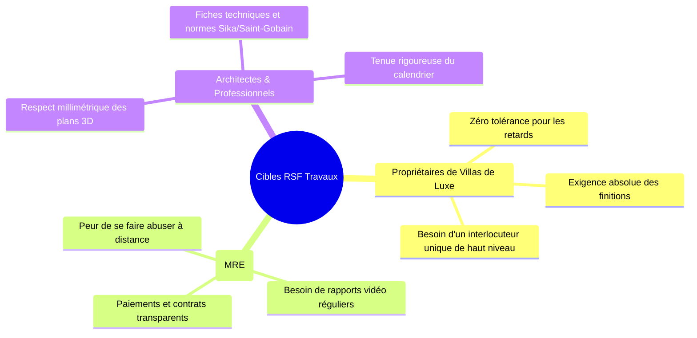

# AUDIT STRATÉGIQUE DU CONTENU ARABE & COPYWRITING DE LUXE
**Rôle :** Content Strategist & Lead Arabic Copywriter (Spécialiste Architecture, Rénovation Prestige & BTP Maroc)  
**Projet :** RSF Travaux (Portail Bilingue — Version Arabe `/ar/`)  
**Date d'évaluation :** Septembre 2026  
**Statut :** Document d'Orientation Stratégique & Plan d'Amélioration Éditoriale  

---

## 1. Diagnostic Stratégique Global (التشخيص التحريري الشامل)

### A. Positionnement de Marque & Perception de Valeur
RSF Travaux ne doit pas être perçu comme un simple intermédiaire ou un annuaire d'artisans indépendants (*« صباغين وبناية »*), mais comme une **Entreprise Générale de Bâtiment & Contractant Général d'Élite** (*شركة مقاولات عامة، تهيئة معمارية وتجديد شامل وتسليم المفتاح في اليد*).

| Critère d'évaluation | Note / 10 | Diagnostic du Content Strategist |
| :--- | :---: | :--- |
| **Ton de Marque & Prestige (الرقي والهيبة المعمارية)** | **8.5 / 10** | Très bon niveau littéraire. Le vocabulaire évite l'arabe dialectal vulgaire tout en restant moderne et accessible. Quelques tournures calquées sur le français méritent d'être arabisées avec plus de noblesse. |
| **Ancrage Culturel Marocain (الخصوصية المعمارية المغربية)** | **9.0 / 10** | Excellente référence aux quartiers prestigieux (Bouskoura, Californie, Racine, Anfa, Souissi) et aux matériaux nobles prisés au Maroc (Travertin, Zellige fassi, Marbre, Tadelakt). |
| **Copywriting de Conversion & Réassurance (علم نفس الإقناع)** | **8.2 / 10** | Les 3 grandes peurs des propriétaires de villas au Maroc (retards de chantier, dépassement de budget, malfaçons après livraison) sont abordées, mais peuvent être désamorcées avec encore plus d'autorité contractuelle. |
| **Cohérence des Données & Terminologie (دقة الأرقام والمصطلحات)** | **8.0 / 10** | **Anomalie détectée :** Présence résiduelle du chiffre « 14 » sur la page `ar/references.html` alors que le standard officiel est de 18 métiers. Quelques disparités mineures sur les délais de réponse. |
| **SCORE ÉDITORIAL GLOBAL** | **8.4 / 10** | **Base solide de haut niveau, prête à être sublimée en standard d'excellence.** |

---

## 2. Psychologie des Cibles & Leviers de Conversion au Maroc

Un Content Strategist analyse d'abord **à qui s'adresse le texte** et **quels sont les déclencheurs émotionnels d'achat** :

### Les 3 Arguments Massues à marteler en Arabe :
1. **الميزانية المغلقة والمضمونة (Le Budget Fixe Garanti) :**  
   *« ما يتم توقيعه في المقايسة هو بالضبط ما تدفعونه — لا زيادات مفاجئة ولا مصاريف خفية أثناء الأشغال. »*
2. **الالتزام الصارم بآجال التسليم (Le Respect Contractuel des Délais) :**  
   *« جدول زمني محكم ومؤطر تعاقدياً مع التزام بتعويضات التأخير — نسلمكم عقاركم في التاريخ المتفق عليه. »*
3. **مخاطب تقني موحد وضمانة عشرية (L'Interlocuteur Unique & Garantie Décennale) :**  
   *« وداعاً لفوضى تعدد الحرفيين؛ مهندس مشروع واحد يواكبكم من أول رسم حتى تسليم المفتاح مع ضمانة عشرية قانونية. »*

---

## 3. Revue Éditoriale Détaillée Page par Page (Ce qu'il faut corriger)

### 1. الصفحة الرئيسية (`ar/index.html`)

#### A. العنوان الرئيسي (Hero Headline) :
- **Texte actuel :**  
  `نحول مساحتكم إلى فضاء عصري يجسد تطلعاتكم.`  
  *(C'est une formule courante, un peu passe-partout).*
- **Proposition recommandée par l'expert (Plus impactante & statutaire) :**  
  `فخامة معمارية، دقة هندسية، وتسليم المفتاح في اليد.`  
  *Sous-titre :*  
  `من الدراسات المعمارية والتصميم الداخلي إلى التجديد الشامل وأدق التشطيبات بالدار البيضاء وكافة أنحاء المغرب. نلتزم بالآجال الصارمة، الميزانية المحددة، والتميز الذي لا يقبل المساومة.`

#### B. أزرار الدعوة للاتخاذ إجراء (CTAs) :
- **Actuel :** `ناقش مشروعك معنا`  
  *Conseil :* Tutoiement / vouvoiement incertain. Dans le luxe au Maroc, on vouvoie avec déférence.  
- **Recommandé :** `ناقشوا تفاصيل مشروعكم مع مهندسنا` أو `اطلبوا استشارتكم التقنية الأولية`

---

### 2. صفحة آراء العملاء والمراجع (`ar/references.html`)

#### A. Correction Impérative d'Incohérence Chiffrée :
- **Ligne actuelle :**  
  `14`  
  `تخصصاً معمارياً`  
- **Correction immédiate :**  
  `18`  
  `تخصصاً معمارياً متكاملاً`  
  *(Harmonisation indispensable avec les 18 métiers du site).*

#### B. Témoignages Clients (Social Proof) :
- Les témoignages existants sont très bons (Karim & Noura à Bouskoura, Riad à Marrakech).
- **Recommandation d'optimisation :** Ajouter une mention subtile de la typologie du chantier :  
  `« فيلا 420 م² · بوسكورة — أشغال تجديد شامل وتسليم المفتاح في 5 أشهر »`. Cela crédibilise immédiatement l'échelle industrielle et le sérieux de l'entreprise.

---

### 3. صفحة التواصل والمقايسة (`ar/contact.html`)

#### A. Suppression des termes trop promotionnels / réducteurs :
- **Terme actuel :** `المعاينة التقنية الأولى مهداة بدون التزام` / `زيارة مهداة`  
  *Critique :* Le mot *« مهداة »* (offerte en cadeau) renvoie à un registre de solde de supermarché. Dans l'ingénierie et l'architecture de prestige, une visite technique n'est pas un « cadeau », c'est un engagement de professionnalisme.
- **Formule recommandée :**  
  `معاينة تقنية وتشخيص أولي مجاني لموقعكم وبدون أي التزام تعاقدي.`

#### B. Harmonisation de la promesse de réactivité :
- En haut de page : `خلال 24 ساعة`
- Sur la carte WhatsApp : `في أقل من 4 ساعات`
- Sur la bannière de soumission : `خلال ساعتين`
- **Formulation unifiée recommandée :**  
  `« استجابة أولية فورية عبر واتساب، ومقايسة تفصيلية مكتوبة خلال 24 إلى 48 ساعة. »`

---

### 4. صفحة المنهجية الهندسية (`ar/methode.html`)

- **Excellente structure en 5 étapes :**
  1. `الاستماع والتشخيص الميداني` (Écoute & Diagnostic)
  2. `التصميم الهندسي والمقايسة المفصلة` (Conception 3D & Devis)
  3. `تحضير الورش والهندسة الإنشائية` (Gros-Œuvre & Réseaux)
  4. `أشغال التشطيبات الدقيقة والديكور` (Finitions & Décoration)
  5. `التسليم الرسمي والضمانة التعاقدية` (Livraison Clé en Main & Garantie)
- **Recommandation de style :** Renforcer le lexique de l'assurance : remplacer *« نحن لا نترك شيئاً للصدفة »* par *« هندسة دقيقة لا تترك مجالاً للارتجال أو المفاجآت »*.

---

### 5. صفحات الخدمات الـ 18 (`ar/service-*.html`)

- **Vocabulaire technique à valoriser :**
  - Pour la **Pasta Espagnole** : Utiliser *« طلاء أحادي الطبقة معدني عازل للرطوبة وأشعة الشمس »*.
  - Pour l'**Effet Travertin** : Mentionner *« محاكاة دقيقة لعروق ومسامات حجر الترافرتين الإيطالي النبيل »*.
  - Pour l'**Étanchéité** : Mentionner obligatoirement *« اختبار الغمر المائي الإلزامي لمدة 48 ساعة »* (gage absolu de professionnalisme chez les promoteurs et architectes).
  - Pour le **Vitrage Accordéon** : Mentionner *« ستائر زجاجية بانورامية قابلة للطي والسحب بدون فواصل عمودية مرئية »*.

---

## 4. Glossaire Architectural de Prestige (Lexique Recommandé)

Pour maintenir une cohérence irréprochable sur l'ensemble des pages arabes, voici la grille terminologique de référence à appliquer :

| Terme Français | Traduction Actuelle / Littérale | Formule d'Élite Recommandée |
| :--- | :--- | :--- |
| **Clé en main** | تسليم المفتاح | **تسليم المفتاح في اليد مع الضمان الكامل** |
| **Tous Corps d'État (TCE)** | كافة الحرف / كافة التخصصات | **مقاولات عامة وكافة التخصصات الإنشائية والمعمارية** |
| **Interlocuteur unique** | مخاطب واحد | **مخاطب تقني موحد ومسؤول مباشر عن الورش** |
| **Devis gratuit sans engagement** | معاينة مهداة | **تشخيص تقني ومقايسة تفصيلية بدون أي التزام** |
| **Garantie décennale** | ضمان 10 سنوات | **الضمانة العشرية القانونية لسلامة المنشآت** |
| **Finitions haute précision** | تشطيبات دقيقة | **تشطيبات معمارية متناهية الدقة والكمال** |
| **Clientèle MRE (Diaspora)** | المقيمين بالخارج | **مغاربة العالم والمستثمرون أصحاب المشاريع بالمغرب** |
| **Isolation & Étanchéité** | عزل الماء | **أنظمة العزل المائي والحراري المعتمدة دولياً** |

---

## 5. Plan d'Action & Prochaines Étapes de Réécriture

1. **Correction d'anomalie immédiate :** Mettre à jour `ar/references.html` (et `references.html`) pour passer de `14` à `18` corps d'état.
2. **Harmonisation des CTAs et promesses :** Remplacer les occurrences de *« مهداة »* par *« مجانية وبدون التزام »*.
3. **Valorisation du Hero sur l'accueil arabe :** Injecter le slogan statutaire *« فخامة معمارية، دقة هندسية، وتسليم المفتاح في اليد »*.
